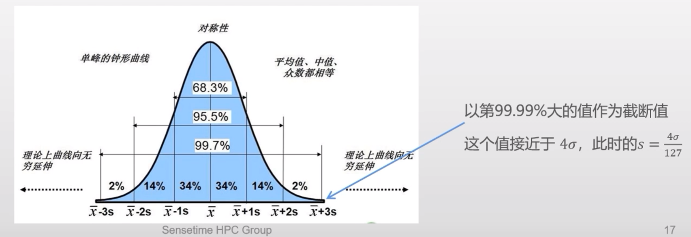
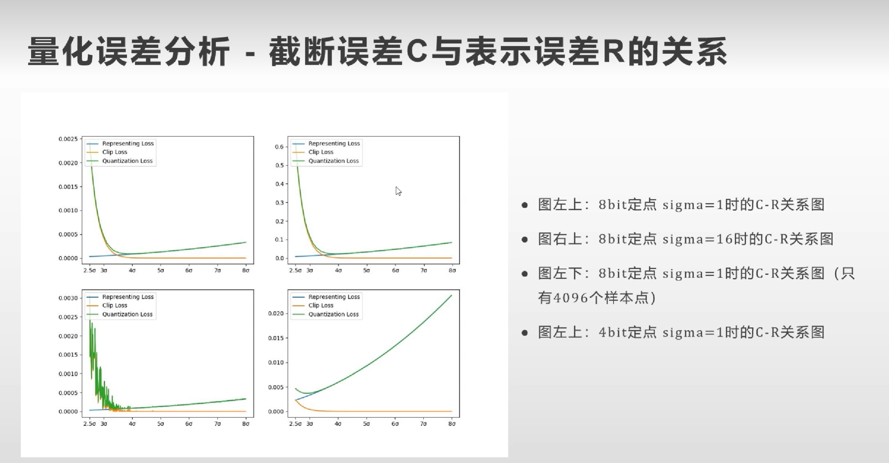

# 参数选择与量化误差分析

经常采用**MSE**和**SNR**来评估量化前后误差。假设放缩因子为$s$，量化前值为$x$,量化后为$Q(x,s)$,反量化为$x^{\prime}=DQ(Q(x,s),s)$。
$$
L_{MSE} = \frac{\sum_{i=1}^{N}{(x_{i}-x_{i}^{\prime})^2}}{N}
$$

$$
L_{N/S} =\frac{\sum_{i=1}^{N}{\frac{(x_{i}-x_{i}^{\prime})^2}{x_i^2}}}{N}
$$

其中SNR相较于MSE没有量纲，是误差平方与量化前值平方的比值。

量化函数存在取整，因此其导数几乎处处为零，且并不连续，性质很差。

#### 量化参数选择

选取一个合适的s，使得量化误差最小（这里不考虑zero point，采用对称量化）
$$
s^*=\mathop{argmin}_{x} \frac{\sum_{i=1}^{N}{(x_{i}-x_{i}^{\prime})^2}}{N}
$$
MSE误差主要来自于网络中较大的项，因为边界值MSE是发散的。我们可以设计足够大的$s$，对应的截断值$s*127.5$更大，使得所有的边界值都被表示。

- **方案1：最大值截断**

  最大值截断能够解决上面的问题，直接**按照tensor中最大的元素作为边界进行量化**。
  $$
  S_{MAX}=\frac{max(abs(X))}{127}
  $$
  对于$x_{i}\sim N(0,1)$ 且独立同分布下，假设总体$X$元素数量趋近于无穷大，那么$E\{{max(X)}\}$ 也趋近于无穷大，此时$S_{MAX}$也趋近于无穷大。
  $$
  \begin{align*}
  E\{\operatorname{Max}(X)\} &=\int_{-i n f}^{+i n f} u P(\operatorname{Max}(X)=u) du\\
  &=C_{N}^{1} \int_{-i n f}^{+i n f} u \varphi \rho(u)\left(\int_{-i n f}^{u} \varphi(v) d v\right)^{N-1} d u
  \end{align*}
  $$
  当元素的数量趋近于无穷大时，即$N\to\infty$ 时，上述极限为：
  $$
  \lim _{N \rightarrow i n f}\left(C_{N}^{1} \int_{-i n f}^{+i n f} u \varphi(u)\left(\int_{-i n f}^{u} \varphi(v) d v\right)^{N-1} d u\right)=\sqrt{2 \log (N)}=i n f
  $$
  此时，放缩因子$s$也会趋于无穷大：
  $$
  S_{M A X}=\frac{\sqrt{2 \log (N)}}{127}=\frac{i n f}{127}=i n f
  $$
  同时，相应的MSE损失误差也会趋于无穷大
  $$
  \text { will have: } \lim _{N \rightarrow inf }\left(E\left\{L_{M S E}\right\}\right)= inf
  $$
  **最大值截断在元素数量越来越多时，误差会越来越大。**可能batch size越大，量化误差越大，这很不合理。

- **方案2：分位数截断**

  数值的分布波动由标准差$\sigma$决定，对于正态分布来说$3\sigma$的范围即可覆盖分布内大部分的数值。
  $$
  s_{k-\sigma}=\frac{k*\sigma}{127}
  $$
  由于$\sigma$与$N$无关，因此当$N$趋于无穷大时，量化误差的期望是收敛的。
  $$
  E\left\{L_{M S E}\right\}=\int_{-k \sigma-\frac{s}{2}}^{k \sigma+\frac{s}{2}}\left(x^{\prime}-x\right)^{2} \varphi(x) d x+\int_{k \sigma+\frac{s}{2}}^{i n f}(x-k \sigma)^{2} \varphi(x) d x+\int_{-i n f}^{-k \sigma-\frac{s}{2}}(x+k \sigma)^{2} \varphi(x) d x
  $$
  上式的三项都是有界的[1] ，因此**量化误差的期望是有界的**。

  在实践中，我们往往不使用$k\sigma$而是利用分位点与$k\sigma$的关系来确定截断值，因为我们**对数据的$\sigma$是未知的**。

  但是我们可以从数值出现的位点倒推，类似于$3\sigma$原则对应$99.73\%$的分布，我们将tensor中的数值排序，选取第$99.99\%$大的值作为截断点，相当于选取了$4\sigma$的位置。

  

- **方案3：最优截断**

  我们已经求出了$E\{L_{MSE}\}$ 的表达式，能否直接解出最优的截断值$c$和尺度因子$s$？这里不局限于高斯分布，直接求取广义分布$p(x)$的最优截断。三段误差：表示误差，上截断误差，下截断误差。
  $$
  E\left\{L_{M S E}\right\}=\int_{c-\frac{s}{2}}^{c+\frac{s}{2}}\left(x^{\prime}-x\right)^{2} p(x) d x+\int_{c+\frac{s}{2}}^{i n f}(x-c)^{2} p(x) d x+\int_{-i n f}^{-c-\frac{s}{2}}(x+c)^{2} p(x) d x
  $$

  - **处理表示误差**
    $$
    \int_{c-\frac{s}{2}}^{c+\frac{s}{2}}\left(x^{\prime}-x\right)^{2} p(x) d x = P\left(-c-\frac{s}{2}<x<c+\frac{s}{2}\right) \frac{s^{2}}{12}
    $$

  - **处理截断误差**
    $$
    \begin{align*}
    \int_{c+\frac{s}{2}}^{i n f}(x-c)^{2} d P_{1}(x) &=(x-c)^{2} P(x)-\int_{c+\frac{s}{2}}^{i n f} P_{1}(x) d(x-c)^{2} \\
    &=(x-c)^{2} P_{1}(x)-\left.2\left((x-c) P_{2}(x)-P_{3}(x)\right)\right|_{c+\frac{s}{2}} ^{inf}
    \end{align*}
    $$
    最终我们得到完整的损失函数，就是**Bernard Widrow公式**：
    $$
    E\{L_{MSE}\} =(x-c)^{2} P_{1}(x)-\left.2\left((x-c) P_{2}(x)-P_{3}(x)\right)\right|_{c+\frac{s}{2}} ^{inf} \\ + (x+c)^{2} P_{1}(x)-\left.2\left((x+c) P_{2}(x)-P_{3}(x)\right)\right|_{-c-\frac{s}{2}} ^{-inf}\\ + (P_1(c+\frac{s}{2})-P_1(-c-\frac{s}{2}))\frac{s^2}{12}
    $$

  这个公式是量化核心成果之一，表明量化误差是正负截断误差与**表示误差**的累积和。  

  对于高斯分布而言，截断误差随着截断值的增长而指数级收敛；**表示误差随截断值二次方增长**。

  **在截断值不变的情况下**，**表示误差随scale的增长而增长，增长速度为二次方级**。

#### 量化误差分析 -截断误差C与表示误差R的关系

从上图可以看出：

- 随着$k\sigma$的增大，截断误差呈现一个指数下降的关系，表示误差呈现一个平坦的二次上升的关系。当$k=4$时整体的误差最小。
- 从图左上和右上看出，这种**关系不受$\sigma$本身值的影响**，这种选$4\sigma$为截断值的方式是稳定的。
- **当样本不大时**（4096，其他图是1百万个），也就是tensor尺寸比较小时，截断误差波动很大。建议选用更大的截断值，可以使用max-min方法。
- 当量化位数选取更小时（比如4bit），**表示误差将会很大**，最优截断值变为$3\sigma$。

**最优估计存在的问题**：

- 最优截断要求pdf三阶积分，对于大部分分布来说，无法求得解析解。
- 很多情况下，局部的MSE并不是全局MSE最优的。
- 数据量小时，估计的方差很大，建议使用max-min。

#### 量化误差分析

上面我们只讨论了一个tensor上的误差分析，我们接下来讨论网络中的输出误差分析。

#### 参考文献

- [1] [量化参数选择与误差分析](https://www.bilibili.com/video/BV1QF41157aM?share_source=copy_web)
- [2] [量化误差分析](https://www.bilibili.com/video/BV1V94y117Ej?share_source=copy_web)

