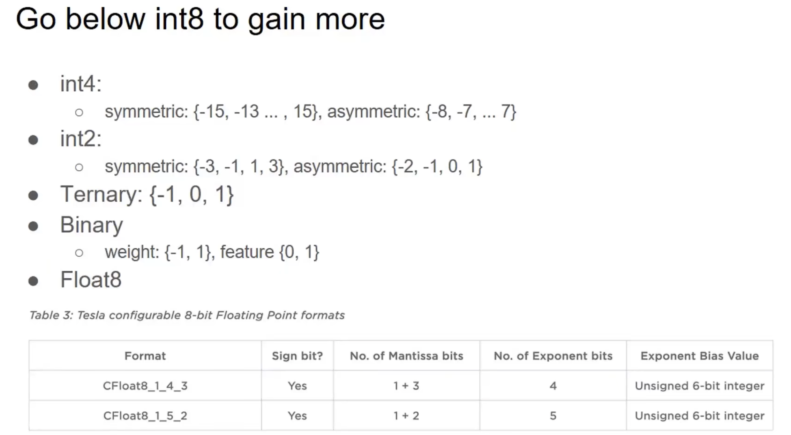
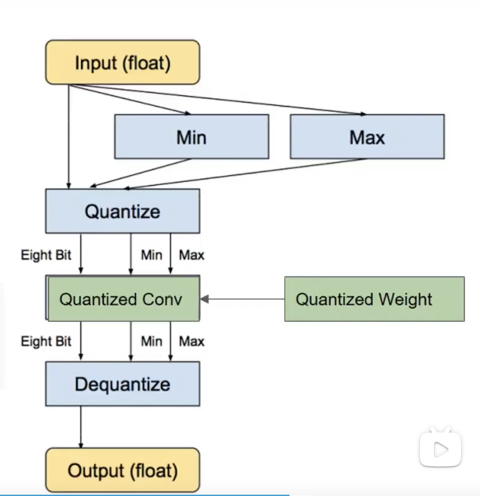

# Idea

- 量化之外的东西，量化不止可以加速。量化本身就是一种特殊的离散化，对于神经网络来说，他是一种软的剪枝。低比特量化采用对称量化，需要解决很多问题：0的表示；最小负值的表示。

- **动态量化**是在推理的过程中，对输入tensor进行动态的量化（计算scale stats）, 而对权重进行静态量化。

  

- **量化对齐**：对于具有多个输入的算子，比如add操作和concat操作，两个输入的scale很可能是不相同的，直接相加结果显然是不对的（不在一个映射空间），需要做重量化进行scale的对齐，或者重新装为浮点进行运算。